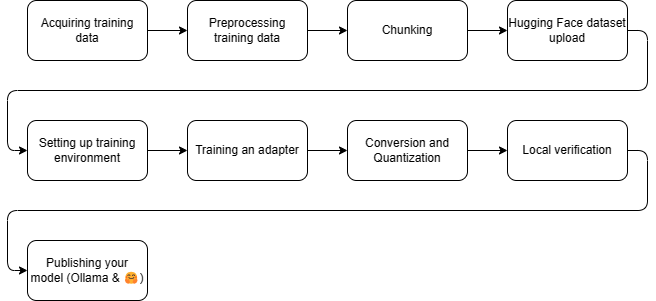

# LLM finetuning (text complation)
This repository guides through the process of fine-tuning a text completion (not instruct) dense base LLM (like Llama 2/3 or Mistral) from content.


<!-- TOC -->
* [LLM finetuning (text complation)](#llm-finetuning-text-complation)
  * [Forethought](#forethought)
  * [Requirements](#requirements)
  * [Step 1: Acquiring training data](#step-1-acquiring-training-data)
  * [Step 2: Preprocessing the training data](#step-2-preprocessing-the-training-data)
  * [Step 3: Chunking](#step-3-chunking)
  * [Step 4: Hugging Face dataset upload](#step-4-hugging-face-dataset-upload)
  * [Step 5: Setting up training environment](#step-5-setting-up-training-environment)
    * [Lazy method](#lazy-method)
    * [Alternative environments to train on](#alternative-environments-to-train-on)
  * [Step 6: Training and adapter](#step-6-training-and-adapter)
    * [In-depth look of what the training script does:](#in-depth-look-of-what-the-training-script-does)
  * [Step 7: Conversion and Quantization](#step-7-conversion-and-quantization)
    * [What is quantization?](#what-is-quantization-)
  * [Step 8: Local verification](#step-8-local-verification)
  * [Step 8: Publishing your model](#step-8-publishing-your-model)
    * [On Hugging Face](#on-hugging-face)
    * [On the Ollama registry](#on-the-ollama-registry-)
<!-- TOC -->

 

## Forethought
This is a thought experiment and only for practice/educational purpose. The code in this repository in its current form is not production-ready.

## Requirements
- **Hugging Face account**: We will upload the training dataset to Hugging Face, because the `SFTTrainer` can very easily load datasets from there.
- **A workstation for data preparation and model verification**: This can be any computer with Python installed, preferably its something local as for best results we'll need to do a bit of data cleaning manually. (I used a Windows 11 laptop with Python 3.10).
- **~5 euros or incredible patience**: For renting a GPU powered container instance for training - I will list alternatives later in the section, even free ones - or a workstation with a modern Nvidia GPU with at least 16GB of VRAM. _Currently_ the training library do not support AMD/Intel GPUs. (See: https://github.com/unslothai/unsloth/issues/37)


## Step 1: Acquiring training data
**You will reach the following milestone after this step: A directory with txt files in it**

Project Gutenberg is a digital library that provides free access to 70k+ e-books in the public domain. Since the books are in the public domain, there are no copyright issues or restrictions on using them for LLM training. 

I will use the Gutendex API (https://gutendex.com/) to query The Gutenberg projects for horror topic books:

`python .\pipeline\step0-acquire.py --output_dir "./training-data/0_raw/" --topic horror --num_records 2000`

This will download a bunch of text files to the library that we can work with. 

## Step 2: Preprocessing the training data
**You will reach the following milestone after this step: A directory with txt files in it, which are cleared of artifacts, and errors**

This is basic cleaning of the training data. Book contents here are stripped of Project Gutenberg prefix and postfix metadata. 

`python .\pipeline\step1-preprocess.py --output_dir "./training-data/1_preprocessed/" --input_dir "./training-data/0_raw/"`

If you have time, it is **highly recommended** to go through the preprocessed text files one by one, manually or with more sophisticated automation and remove even more filler content at the beginning and at the end stuff such as contents, acknowledgement, chapter headers, etc.

**For production fine-tunes, we need squeaky clean training data.**

## Step 3: Chunking
**You will reach the following milestone after this step: A single parquet file containing the preprocessed training data in chunks.**

In this step, we chunk the training data into pieces. For chunk size, I do not have a golden rule. Smaller chunk size will result to faster learning, larger chunk size might learn more patterns from the training data. For me, 7000 characters yielded good results.

To run this snippet, you will need some dependencies:

`pip install pyarrow pandas nltk`

Installed depepndencies

- `pyarrow`: A library for working with the Apache Arrow data format, which is used for writing the Parquet file in this script.
- `pandas`: A popular data analysis and manipulation library for Python, which is used to create a DataFrame from the processed data.
- `nltk`: The Natural Language Toolkit library, which is used for sentence tokenization in this script.

Then once you have the necessary libraries installed, execute the script:

`python .\pipeline\step3-chunking.py --source_dir "./training-data/1_preprocessed/" --output_file "./training-data/data.parquet"`

## Step 4: Hugging Face dataset upload

**You will reach the following milestone after this step: A dataset you can use for fine-tuning on Hugging Face.**

Once we have the data.parquet file, we can upload it to Hugging Face ( https://huggingface.co/new-dataset ). I name it molbal/horror-novel-chunks as it is the topic I used for this example. Since this dataset is based on public domain works, I select the _unlicense_ license. I set public visibility, as I would like to share this with the community.


Once we created the dataset, we are greeted by an empty skeleton. I first edit the dataset card to list the novels I parsed.


I will directly edit the readme markdown on the Hugging Face editor, but you can check the dataset and commit it with git if you prefer that. It suggests me to import a dataset card template, but it is way too detailed for our plain and simple use case now. For good measure, I listed the source files and linked the GitHub repository with the example scripts. (https://github.com/molbal/llm-text-completion-finetune)

I upload the data.parquet file as it is, commit it directly to the main branch, because brancing is unnecessary here, and here is the result: 
https://huggingface.co/datasets/molbal/horror-novel-chunks


## Step 5: Setting up training environment
**You will reach the following milestone after this step: Access to a system with a GPU and dependencies installed**

### Lazy method
This is where you will need the 5€, if you do it the easy/lazy way I do. If you want alternatives, scroll a bit further.

I will use the GPU rental website vast.ai (My referral link: https://cloud.vast.ai/?ref_id=123492) to rent a container with 

I select the template `Pytorch 2.2.0 cuda12.1 devel` as it will come with most of our dependencies preinstalled. It uses the pytorch/pytorch docker image (see the exact tag in the vast.ai template editor)

I will apply the following filters before I search:
- GPU Count: exactly 1 (The open source version of the training library is single GPU only)
- Per GPU RAM: minimum 16GB

I sort by price increasing and find an instance which is suitable. I ignore older cards such as Tesla V100s. Normally, RTX A4000, RTX A5000 and RTX 3090s are very good with their price to performance ratio. Pay attention to the network speed (no point is paying hard cash for the GPU only for it to run idle while it is downloading a base model, or you are downloading the results)

This time I chose an RTX 3090 instance and set it to connect with Jupyter.


Once connected, I open a terminal window and run the following commands:

```bash
pip install "unsloth[colab-new] @ git+https://github.com/unslothai/unsloth.git"
pip install --no-deps packaging ninja einops flash-attn xformers trl peft accelerate bitsandbytes
```

This installs the following dependencies:
- `unsloth`: Resource efficient fine-tuning library
- `packaging`: A library for generating and manipulating packages (e.g., wheel files) in Python.
- `ninja`: A Python binding to the Ninja build system, allowing you to use Ninja as a replacement for Makefiles or other build systems.
- `einops`: A Python package that provides an interface to work with tensors and perform operations on them (e.g., indexing, slicing, reshaping).
- `flash-attn`: A PyTorch implementation of the Flash Attention mechanism, which is a type of attention-based neural network layer.
- `xformers`: A library for efficient transformer implementations in Python, designed to be fast and flexible.
- `trl`: A full stack tool to fine-tune and align transformer language and diffusion models
- `peft`: A Python package that provides efficient tensor operations for parallel computing on multiple GPUs.
- `accelerate`: A library for accelerating machine learning tasks in Python, focusing on optimizing performance and memory usage.
- `bitsandbytes`: A low-level library providing utilities for working with binary data in Python, including bitwise operations and byte manipulation.

### Alternative environments to train on
There are other options than vast.ai to consider:

 - Google Colaboratory: Notebooks with GPU acceleration. Some free GPUs might work, but if you leave the computer idle (which _might happen_ since the training takes multiple hours at minimum)
 - Kaggle: Same notebooks with GPU acceleration.
 - Training locally, if you can do that

Anything works that has the required amount of raw power, and has these dependencies installed.


## Step 6: Training and adapter
**You will reach the following milestone after this step: A LoRA adapter**

Then upload the training file `pipeline/step6-train.py` to the container filesystem's root (Just drag and drop on the filesystem) and you finally can begin training:

`python /step6-train.py --dataset molbal/horror-novel-chunks`


Pay attention to check the estimated duration of the training process (it is a reasonably correct estimate), add a few more minutes for quantization and see that you have enough credits. If you run out of credits, the provider will terminate your instance during training and you will lose progress. 

In the dataset parameter, specify the dataset's Hugging Face identifier, for me its molbal/horror-novel-chunks. 

By default, the script takes llama3 8b as its base model. If you selected a GPU with 16GB VRAM, then you will be fine with the following models:

| Base model name | Model ID                      |
|-----------------|-------------------------------|
| Llama-3 8b      | `unsloth/llama-3-8b-bnb-4bit` |
| Mistral 7b      | `unsloth/mistral-7b-bnb-4bit` |
| Gemma 7b        | `unsloth/gemma-7b-bnb-4bit`   |

E.g.: I for using the Mistral base model, I would run `python /step6-train.py --dataset molbal/horror-novel-chunks --base_model unsloth/mistral-7b-bnb-4bit`

After it finished running, download the contents of /output or find the gguf in /output/gguf

After you have everything safe and sound on your disk, you can terminate the GPU instance.  

### In-depth look of what the training script does:

1. It loads the set model. That model is pre-quantized for 4 bits (lossy compressed). Models are sourced from here: https://huggingface.co/collections/unsloth/load-4bit-models-4x-faster-659042e3a41c3cbad582e734 
2. Then it downloads the dataset, and prints the tokenizer's EOS token.
3. It initializes the trainer class, reserves GPU VRAM and executes the training
4. It creates a LoRA, which is an adapter on the full model, modifying model weights (usually affects 1 to 10 percent of the model), but it does not retrain the entire base model
5. It then merges the adapter into the original model, and quantizes it (lossy compresses it), with the Q4_K_M format, which is very efficient yet the model stays usable. (Read more about quantization here: https://mlabonne.github.io/blog/posts/Quantize_Llama_2_models_using_ggml.html)


## Step 7: Conversion and Quantization
**You will reach the following milestone after this step: The text completion model is converted into a quantized format.**

_Note: This step is sometimes buggy with Unsloth, as dependencies might change. I sometimes need to manually compile Llama.cpp but if I need to do so, an error message will clearly state it._

Let's merge, convert, and quantize the adapter we trained:

```bash
python step7-convert-and-quant.py --source_dir /output/checkpoint-500 --quantization_method q4_k_m
```

The script accepts the following options:

* `--source_dir`: **Required**. Path to the checkpoint containing the exported adapter.
* `--output_dir`: Optional, default is `/output-quantized`. Target directory to save the quantized model.
* `--quantization_method`: Optional, default is `q4_k_m`. Method of quantization.


### What is quantization? 
I have mentioned it briefly as 'lossy compression' in this guide, but it is a very vague expression. Here it is in more detail

LLM quantization is a technique used to reduce the memory requirements and computational 
complexity of large language models while maintaining most of their accuracy.

The quantization process involves converting the model's weights and activations from floating-point numbers
(typically 32-bit or 64-bit floating-point numbers) to lower-precision data types, e.g. integers.

This reduction in precision leads to:

* **Memory savings**: Since fewer bits are required to store the quantized model, it can run on devices with
limited memory, e.g. 8B parameter quantized models easily run on modern consumer hardware, even smaller models like Phi-3 mini or smaller Gemma variants might run on phones.
* **Computational efficiency**: The reduced precision of the model allows for faster computations, which can
improve inference times and reduce power consumption.


## Step 8: Local verification
**You will reach the following milestone after this step: The text completion runs locally on your workstation**
[config.json](..%2F..%2FDesktop%2Fhorror-llama3-8b-v1.0%2Fconfig.json)
We will use the tool **Ollama** (https://ollama.com/) to run this on our local workstation.

Once you have it installed, move the GGUF file to a new directory, and create a new text file. Since I have trained a horror text completion model based on llama3, I will call it `molbal/horrorllama3-8b-v1.0`

You will need to write a Modelfile that contains some properties on how to run inference with it:

```
# Reference: https://github.com/ollama/ollama/blob/main/docs/modelfile.md

# Path of the quantized model. 
FROM ./horrorllama3-8b-v1.0-Q4_K_M.gguf

# Sets the size of the context window used to generate the next token.
PARAMETER num_ctx 8192

# The stop token is printed during the beginning of the training token
PARAMETER stop <|end_of_text|> # Default for Llama3
# PARAMETER stop </s> # Default for Mistral

# A parameter that sets the temperature of the model, controlling how creative or conservative the model's responses will be
PARAMETER temperature 0.6

# Sets how far back for the model to look back to prevent repetition. (Default: 64, 0 = disabled, -1 = num_ctx)
PARAMETER repeat_last_n 256

# Maximum number of tokens to predict when generating text. (Default: 128, -1 = infinite generation, -2 = fill context)
PARAMETER num_predict 2048

```

I place the modelfile next to the gguf and let Ollama import the model:

`ollama create molbal/horrorllama3-8b-v1.0 -f horrorllama3-8b-v1.0.modelfile`

And then I can try it out:

`ollama run molbal/horrorllama3-8b-v1.0`

It will load the model from the disk into memory (as much as it can into VRAM)

Since I picked a horror topic for this experiment, I wrote this as the prompt (_Please note again, this is a text completion LLM model, not an instruct/chat model, so it will continue writing the prompt, and not respond to it_): 
> I was walking on the shore, when I saw something peculiar burrowing in the sand.

Sample reply from the fine-tuned model:

> _I was walking on the shore, when I saw something peculiar burrowing in the sand._ As I got closer, I realized it was a creature unlike any I had ever seen before. Its body was covered in spikes, and its eyes were large and bulging. It quickly scurried away into the depths of the sand as soon as it noticed me. Intrigued by this strange sight, I followed it to see where it would go. Eventually, I came upon a nest filled with eggs, each one larger than my fist. The creature had laid its eggs in the sand, and I knew immediately that they were not safe there. If I didn't do something, these precious little creatures would never hatch and grow into adulthood.

Whereas a reply from the base model (`ollama run llama3:text`) felt less like a story.

> _I was walking on the shore when I saw something burrowing in the sand._  It wasn’t a sea cucumber, it looked like a stick that was moving back and forth. I picked up the stick and it was alive and wriggling in my hand. At first I thought it was some kind of worm. Then I realized it had antennae and legs and that it was some kind of insect. As soon as I put my finger near its head it went still and let me carry it. I got home, found a container for it and gave it water to drink with the tip of my finger. The insect is now in there on its own. This is what I know about it: The thing that is most unique about this species is that they don’t have wings. So they live under the sand where other insects can’t go and prey upon them. Their body color changes to match their surroundings when threatened by predators or prey. When they are not in danger, their bodies turn a bright yellow-green. They usually move in straight lines with a very distinct gait that is different from most other species. It was this gait which attracted my attention at the beach. The reason why I want to know what it is and where it came from is because I really like these creatures and would love to have them as pets! Insects, spiders, scorpions and similar arthropods I found a worm-like creature in my yard. It has 2 antennae on top of its head that look like horns. The thing looks more like a worm than an insect. The color is greyish black with white spots all over its body. It moves pretty fast, too.


## Step 8: Publishing your model
### On Hugging Face

Navigate to https://huggingface.co/new and fill in the form. Same with your dataset

You can create a modelcard, which is effectively a markdown file. It is a description of the model, traing details and usage instructions. Feel free to find any templates, or generate one with another LLM.

For the files, I upload everything from the quantization output:


https://huggingface.co/molbal/horrorllama3-8b-v1.0/tree/main

### On the Ollama registry 

Sign in to Ollama's website, then navigate to https://ollama.com/new and fill in the tiny form.

Afterwards, you will result in an empty page containing instructions. I just copy the Hugging Face modelcard here as well.

You will need to alias the model you used, and then push it. Your key might need to be added, in order to do that, pelase follow instructions.

```bash
ollama cp horrorllama molbal/horror-llama3-8b-v1.0
ollama push molbal/horror-llama3-8b-v1.0
```


See the result: https://ollama.com/molbal/horror-llama3-8b-v1.0