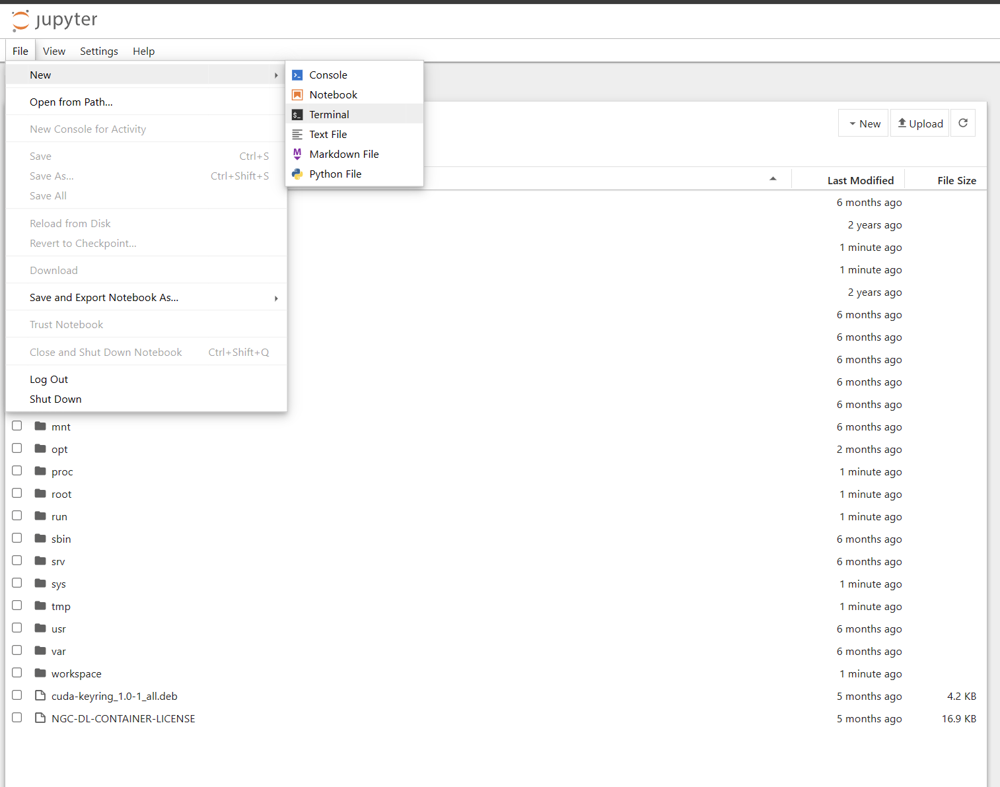

# LLM finetuning (text complation)
This repository guides through the process of fine-tuning a text completion (not instruct) dense base LLM (like Llama 2/3 or Mistral) from content.

## Forethought
This is a thought experiment and only for practice/educational purpose. The code in this repository in its current form is not production-ready.

## Requirements
- **Hugging Face account**: We will upload the training dataset to Hugging Face, because the `SFTTrainer` can very easily load datasets from there.
- **A workstation for data preparation**: This can be any computer with Python installed, preferably its something local as for best results we'll need to do a bit of data cleaning manually. (I used a Windows 11 laptop with Python 3.10)
- **5 euros or incredible patience**: For renting a GPU powered container instance for training - I will list alternatives later in the section, even free ones - or a workstation with a modern Nvidia GPU with at least 16GB of VRAM. _Currently_ the training library do not support AMD/Intel GPUs. (See: https://github.com/unslothai/unsloth/issues/37)

## Step 1: Acquiring training data
**What you will have at the end of this step: A directory with txt files in it**

Project Gutenberg is a digital library that provides free access to 70k+ e-books in the public domain. Since the books are in the public domain, there are no copyright issues or restrictions on using them for LLM training. 

I will use the Gutendex API (https://gutendex.com/) to query The Gutenberg projects for horror topic books:

`python .\pipeline\step0-acquire.py --output_dir "./training-data/0_raw/" --topic horror --num_records 200`

This will download a bunch of text files to the library that we can work with. 

## Step 2: Preprocessing the training data
**What you will have at the end of this step: A directory with txt files in it, which are cleared of artifacts, and errors**

This is basic cleaning of the training data. Book contents here are stripped of Project Gutenberg prefix and postfix metadata. 

`python .\pipeline\step1-preprocess.py --output_dir "./training-data/1_preprocessed/" --input_dir "./training-data/0_raw/"`

If you have time, it is **highly recommended** to go through the preprocessed text files one by one, manually or with more sophisticated automation and remove even more filler content at the beginning and at the end stuff such as contents, acknowledgement, chapter headers, etc.

**For production fine-tunes, we need squeaky clean training data.**

## Step 3: Chunking
**What you will have at the end of this step: A single parquet file containing the preprocessed training data in chunks.**

In this step, we chunk the training data into pieces. For chunk size, I do not have a golden rule. Smaller chunk size will result to faster learning, larger chunk size might learn more patterns from the training data. For me, 7000 characters yielded good results.

To run this snippet, you will need some dependencies:

`pip install pyarrow pandas nltk`

Installed depepndencies

- `pyarrow`: A library for working with the Apache Arrow data format, which is used for writing the Parquet file in this script.
- `pandas`: A popular data analysis and manipulation library for Python, which is used to create a DataFrame from the processed data.
- `nltk`: The Natural Language Toolkit library, which is used for sentence tokenization in this script.

Then once you have the necessary libraries installed, execute the script:

`python .\pipeline\step3-chunking.py --source_dir "./training-data/1_preprocessed/" --output_file "./training-data/data.parquet"`

## Step 4: Hugging Face dataset upload

Once we have the data.parquet file, we can upload it to Hugging Face ( https://huggingface.co/new-dataset ). I name it molbal/horror-novel-chunks as it is the topic I used for this example. Since this dataset is based on public domain works, I select the _unlicense_ license. I set public visibility, as I would like to share this with the community.

Once we created the dataset, we are greeted by an empty skeleton. I first edit the dataset card to list the novels I parsed.

I will directly edit the readme markdown on the Hugging Face editor, but you can check the dataset and commit it with git if you prefer that. It suggests me to import a dataset card template, but it is way too detailed for our plain and simple use case now. For good measure, I listed the source files and linked the GitHub repository with the example scripts. (https://github.com/molbal/llm-text-completion-finetune)

I upload the data.parquet file as it is, commit it directly to the main branch, because brancing is unnecessary here, and here is the result: 
https://huggingface.co/datasets/molbal/horror-novel-chunks

## Step 5: Setting up training environment

### Lazy method
This is where you will need the 5€, if you do it the easy/lazy way I do. If you want alternatives, scroll a bit further.

I will use the GPU rental website vast.ai (My referral link: https://cloud.vast.ai/?ref_id=123492) to rent a container with 

I select the template `Pytorch 2.2.0 cuda12.1 devel` as it will come with most of our dependencies preinstalled. It uses the pytorch/pytorch docker image (see the exact tag in the vast.ai template editor)

I will apply the following filters before I search:
- GPU Count: exactly 1 (The open source version of the training library is single GPU only)
- Per GPU RAM: minimum 16GB

I sort by price increasing and find an instance which is suitable. I ignore older cards such as Tesla V100s. Normally, RTX A4000, RTX A5000 and RTX 3090s are very good with their price to performance ratio. Pay attention to the network speed (no point is paying hard cash for the GPU only for it to run idle while it is downloading a base model, or you are downloading the results)

This time I chose an RTX 3090 instance and set it to connect with Jupyter.

## Step 6: Executing the training itself & Quantizing the model

Once connected, I open a terminal window and run the following commands:

`pip install "unsloth[colab-new] @ git+https://github.com/unslothai/unsloth.git"`

This installs the training library Unsloth: https://github.com/unslothai/unsloth

`pip install --no-deps packaging ninja einops flash-attn xformers trl peft accelerate bitsandbytes`

Thia installs the following packages:

1. `packaging`: A library for generating and manipulating packages (e.g., wheel files) in Python.
2. `ninja`: A Python binding to the Ninja build system, allowing you to use Ninja as a replacement for Makefiles
or other build systems.
3. `einops`: A Python package that provides an interface to work with tensors and perform operations on them
(e.g., indexing, slicing, reshaping).
4. `flash-attn`: A PyTorch implementation of the Flash Attention mechanism, which is a type of attention-based
neural network layer.
5. `xformers`: A library for efficient transformer implementations in Python, designed to be fast and flexible.
6. `trl`: A full stack tool to fine-tune and align transformer language and diffusion models
7. `peft`: A Python package that provides efficient tensor operations for parallel computing on multiple GPUs.
8. `accelerate`: A library for accelerating machine learning tasks in Python, focusing on optimizing performance
and memory usage.
9. `bitsandbytes`: A low-level library providing utilities for working with binary data in Python, including
bitwise operations and byte manipulation.

`git clone https://github.com/ggerganov/llama.cpp`

This clones the llama.cpp library

`cd llama.cpp && make clean && LLAMA_CUDA=1 make all -j`

And this one compiles it.

Then upload the training file `pipeline/step6-train.py` to the container filesystem's root (Just drag and drop on the filesystem)

And you finally can begin training:

`python /step6-train.py --dataset molbal/horror-novel-chunks`

Make sure to take note of the EOS Token, in my case it is `<|end_of_text|>` as we will need it when we set up our fine-tuned model up for inference. Also pay attention to check the estimated duration of the training process (it is a reasonably correct estimate) and see that you have enough credits. If you run out of credits, the provider will terminate your instance during training and you will lose progress. 

In the dataset parameter, specify the dataset's Hugging Face identifier, for me its molbal/horror-novel-chunks. 

By default, the script takes llama3 8b as its base model. If you selected a GPU with 16GB VRAM, then you will be fine with the following models:

| Base model name | Model ID                      |
|-----------------|-------------------------------|
| Llama-3 8b      | `unsloth/llama-3-8b-bnb-4bit` |
| Mistral 7b      | `unsloth/mistral-7b-bnb-4bit` |
| Gemma 7b        | `unsloth/gemma-7b-bnb-4bit`   |

E.g.: I for using the Mistral base model, I would run `python /step6-train.py --dataset molbal/horror-novel-chunks --base_model unsloth/mistral-7b-bnb-4bit`

After it finished running, download the contents of /output or find the gguf in /output/gguf

After you have everything safe and sound on your disk, you can terminate the GPU instance.  

### In-depth look of what the training script does:

1. It loads the set model. That model is pre-quantized for 4 bits (lossy compressed). Models are sourced from here: https://huggingface.co/collections/unsloth/load-4bit-models-4x-faster-659042e3a41c3cbad582e734 
2. Then it downloads the dataset, and prints the tokenizer's EOS token.
3. It initializes the trainer class, reserves GPU VRAM and executes the training
4. It creates a LoRA, which is an adapter on the full model, modifying model weights (usually affects 1 to 10 percent of the model), but it does not retrain the entire base model
5. It then merges the adapter into the original model, and quantizes it (lossy compresses it), with the Q4_K_M format, which is very efficient yet the model stays usable. (Read more about quantization here: https://mlabonne.github.io/blog/posts/Quantize_Llama_2_models_using_ggml.html)

## Step 7: Trying out locally
TODO install ollama
write modelfile
try

## Step 8: Publishing your model
### On Hugging Face

### On the Ollama registry 